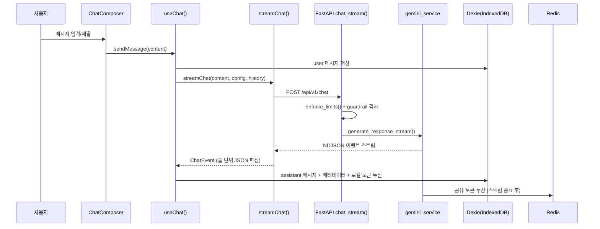

# Milkyway-33 기술 문서

> 이 문서는 Milkyway-33의 **백엔드 스트리밍 구조**와 **프론트엔드 채팅 수신/저장 구조**를 정리한 운영·구현 문서다.
> 단순 소개가 아니라, 개발자가 기능을 수정·확장하기 전에 영향 범위를 빠르게 파악하기 위한 참조용이다.
> 모든 단정 서술은 실제 코드 기준이며, 추측·향후 아이디어는 "확장 아이디어" 또는 "주의"로 분리했다.
> Notion 동기화 페이지: "Milkyway-33 기술 문서" (코드 없는 버전). 미래 기능 계획은 [LLM 엔지니어링 로드맵](./LLM-ENGINEERING-ROADMAP.md) 참조.

## 목차
1. [프로젝트 개요](#1-프로젝트-개요)
2. [전체 아키텍처](#2-전체-아키텍처)
3. [백엔드 구조: FastAPI + Gemini](#3-백엔드-구조-fastapi--gemini)
4. [API 라우팅과 엔드포인트](#4-api-라우팅과-엔드포인트)
5. [스트리밍 프로토콜: NDJSON](#5-스트리밍-프로토콜-ndjson)
6. [서비스 싱글톤과 Redis](#6-서비스-싱글톤과-redis)
7. [프론트엔드 채팅 흐름](#7-프론트엔드-채팅-흐름)
8. [ai-elements UI 계층](#8-ai-elements-ui-계층)
9. [Dexie 로컬 저장소](#9-dexie-로컬-저장소)
10. [배포 구조: Vercel](#10-배포-구조-vercel)
11. [운영 / 제한 / 에러 처리](#11-운영--제한--에러-처리)
12. [유지보수 체크리스트](#12-유지보수-체크리스트)
13. [부록: 핵심 파일 위치](#부록--핵심-파일-위치)

---

## 1. 프로젝트 개요

Milkyway-33은 Google Gemini 기반 채팅 앱이다. 프론트엔드와 백엔드가 한 저장소에 있지만 별도 앱처럼 관리된다.

**기술 스택**

| 영역 | 스택 |
|---|---|
| Frontend | React 19, Vite 7, TypeScript, Tailwind v4, shadcn/ui, React Router 7 |
| Chat UI | `src/components/ai-elements/**` 기반 채팅 프리미티브 |
| Local 저장 | Dexie + IndexedDB |
| Backend | Python FastAPI, `google-genai` |
| External state | Upstash Redis |
| Deploy | Vercel (프론트 `dist/`, 백엔드 Python serverless function) |

> ⚠️ **핵심 구조 전제** — 백엔드는 대화 내용을 영구 저장하지 않는다. 대화·설정·로컬 토큰 사용량은 브라우저 IndexedDB(Dexie)에 저장된다. 전체 사용자 **공유** 토큰 누산과 레이트리밋만 Redis를 사용한다. 이 둘(로컬 Dexie vs 공유 Redis)을 같은 데이터로 설명하면 안 된다.

## 2. 전체 아키텍처

사용자 입력부터 저장까지의 데이터 흐름이다.



**역할 요약**
- `ChatComposer`: 사용자 입력과 제출 UI 담당
- `useChat()`: 채팅 상태 머신
- `streamChat()`: 백엔드 스트림을 `AsyncGenerator<ChatEvent>`로 변환
- 백엔드: 표준 SSE가 아니라 **줄 단위 JSON(NDJSON)** 반환 → 프론트는 `\n` 기준으로 잘라 `JSON.parse()`

## 3. 백엔드 구조: FastAPI + Gemini

`backend/main.py`에서 FastAPI 앱을 만들고 `chat.router`를 `/api/v1` prefix로 mount한다. 따라서 실제 엔드포인트는 `chat.py`의 라우터 경로 앞에 `/api/v1`이 붙는다.

- CORS는 `http://localhost:3333` / `127.0.0.1:3333`을 허용한다.
- 채팅 로직은 `gemini_service`(싱글톤)가 `google-genai`의 `generate_content_stream`으로 처리한다.
- 응답은 토큰 단위로 스트리밍되며, 스트림 종료 시 `usage_metadata`를 모아 Redis에 누산한다.

## 4. API 라우팅과 엔드포인트

근거 파일: `backend/app/api/endpoints/chat.py`

| Method | Path | 역할 |
|---|---|---|
| GET | `/api/v1/chat/daily-usage` | 일일 사용 가능 횟수 조회 |
| POST | `/api/v1/chat` | 채팅 메시지 전송, Gemini 스트리밍 응답 |
| POST | `/api/v1/chat/summarize` | 대화 요약 제목 생성 |
| GET | `/api/v1/chat/token-usage` | Redis 누산 공유 토큰 사용량 조회 |
| GET | `/api/v1/chat/model-info` | 현재 Gemini 모델 메타데이터 조회 |

**`POST /api/v1/chat` 처리 순서** (`chat_stream()` 기준)
1. `enforce_limits(http_request)` — 쿨다운·일일 한도 검사
2. `guardrail_service.check_injection(request.message)` — 입력 검사
3. `guardrail_service.format_with_delimiters(request.message)` — 입력을 삼중따옴표로 감싸 격리
4. `StreamingResponse(gemini_service.generate_response_stream(...))` 반환
5. 응답 헤더에 `X-Daily-Limit`, `X-Daily-Remaining` 포함

## 5. 스트리밍 프로토콜: NDJSON

> 🚨 **이름은 SSE, 실제는 NDJSON.** 응답 `media_type`은 `text/event-stream`으로 설정돼 있지만, payload는 `event:` prefix가 붙는 표준 SSE가 **아니다**. 각 줄마다 JSON 객체 하나를 보내는 NDJSON 방식이다. 프론트(`src/api/chat.ts`)는 `\n`으로 줄을 나눠 `JSON.parse()` 한다.

근거 파일: `backend/app/services/gemini.py` (생성) / `src/features/chat/types.ts` (타입)

**이벤트 예시**
```json
{"status": "thinking", "model": "gemini-2.5-flash-lite"}
{"status": "generating"}
{"status": "streaming", "chunk": "안녕"}
{"status": "complete", "response": "...", "model_used": "...", "usage_metadata": {}}
{"status": "error", "message": "..."}
```

**이벤트 타입**

| status | 의미 | 주요 필드 |
|---|---|---|
| thinking | 모델 호출 시작 | model |
| generating | 생성 시작 | — |
| streaming | 토큰 청크 도착 | chunk |
| complete | 전체 응답 완료 | response, model_used, usage_metadata, finish_reason, safety_ratings, thought |
| error | 백엔드 처리 중 오류 | message |

> 🔗 **연동 주의** — 이벤트 필드를 바꾸면 생성부(`gemini.py`), 파싱부(`src/api/chat.ts`), 타입(`src/features/chat/types.ts`) 세 곳을 함께 수정해야 한다. 한 곳만 바꾸면 조용히 깨진다.

## 6. 서비스 싱글톤과 Redis

이 프로젝트는 FastAPI 의존성 주입 클래스보다 **모듈 레벨 싱글톤 인스턴스**를 주로 쓴다.

| 싱글톤 | 파일 | 역할 | 초기화 시점 |
|---|---|---|---|
| `gemini_service` | `services/gemini.py` | Gemini client, 모델 정보 캐시, 스트리밍 | import 시 `genai.Client` 생성 |
| `guardrail_service` | `services/guardrail.py` | 입력 길이/패턴/특수문자 검사 | import 시 |
| `token_usage_service` | `services/token_usage.py` | Redis Hash에 공유 토큰 누산 | Redis는 lazy init |
| `redis = Redis.from_env()` | `services/rate_limit.py` | cooldown/daily limiter | import 시 생성 |

> ⚠️ **서버리스 싱글톤 주의** — 프로세스가 재사용되면 싱글톤도 재사용된다. `GeminiService._model_info` 같은 **모델 정보 캐시는 안전**하지만, 사용자별 대화 상태 같은 mutable state를 싱글톤에 저장하면 절대 안 된다.

### Redis 사용처 1 — 레이트리밋 (`services/rate_limit.py`)
- `cooldown_limiter`: 10초에 1회 (`CHAT_COOLDOWN_SECONDS = 10`)
- `daily_limiter`: 24시간에 13회 (`DAILY_LIMIT = 13`)
- client key: `x-forwarded-for`가 있으면 첫 IP, 없으면 `request.client.host`
- 초과 시 HTTP 429 + 헤더 `X-Daily-Limit`, `X-Daily-Remaining`, `Retry-After`, `Cache-Control: no-store`. 일일 한도 초과는 `Retry-After: 86400`으로 구분.

### Redis 사용처 2 — 공유 토큰 누산 (`services/token_usage.py`)
- Redis Hash key: `shared:token_usage`
- 누산 필드: `total_tokens`, `prompt_tokens`, `candidates_tokens`, `thoughts_tokens`, `cached_tokens`, `request_count`
- Gemini 스트림 종료 후 `usage_metadata`가 있으면 `accumulate()` 호출 (실패해도 스트리밍에는 영향 없음)

## 7. 프론트엔드 채팅 흐름

근거 파일: `src/hooks/useChat.ts` (상태 머신), `src/lib/historyBuilder.ts`, `src/services/chatRepository.ts`

**주요 상태**
- `status`: `idle` / `thinking` / `generating` / `streaming`
- `currentResponse`: 스트리밍 중 누적되는 임시 응답
- `currentMetadata`: 응답 완료 후 저장되는 모델/토큰/안전성 메타데이터
- `error`: UI 에러 메시지
- `promptConfig`: 시스템 instruction 등 설정 (Dexie `configs`에서 로드)

**`sendMessage(content)` 흐름**
1. 클라이언트 쿨다운 확인(`cooldownStore`) → 활성 시 중단
2. 대화 없으면 `createNewConversation()` (세션 **최대 5개** 제한)
3. `buildHistory(storedMessages)`로 히스토리 구성 후 user 메시지를 Dexie 저장
4. 첫 메시지면 제목을 30자로 임시 설정
5. `streamChat()` 이벤트를 status별로 처리 → `streaming`에서 청크 누적
6. `complete`에서 assistant 메시지 저장 + `usage_metadata`를 Dexie `tokenUsage`에 누산
7. 메시지 6개 도달 시 `summarizeConversation()`으로 제목 자동 갱신

> ♻️ **에러 복구 동작** — `ChatDailyLimitError` 또는 `ChatRateLimitError`가 나면 방금 저장한 user 메시지를 `deleteMessages()`로 삭제한다. 한도 초과로 답을 못 받은 입력이 대화에 남지 않게 하기 위함이다. 403→"보안 정책 차단", 400→"길이 확인", 429→"간격 제한"으로 메시지를 변환한다.

**`buildHistory()` 정책** (`src/lib/historyBuilder.ts`)
- 좋아요(liked) assistant 쌍을 최대 10개 고정 + 최근 메시지 최대 20개를 병합
- 시간순 정렬 후, 약 40,000 토큰(문자/4 근사) 한도 내로 잘라 전송
- role 매핑: `assistant` → `model`, 그 외 → `user`

## 8. ai-elements UI 계층

`src/components/ai-elements/**`는 채팅 UI 프리미티브 모음이다.
- `Conversation` / `ConversationContent` / `ConversationScrollButton`: 스크롤 컨테이너
- `PromptInput` 계열: 입력창·제출·도구 UI
- `Message` / `MessageContent`: 메시지 렌더링
- `Reasoning`: 모델 thought/reasoning 표시
- `Loader`: 스트리밍/로딩 표시

> 🧱 **유지보수 규칙** — `ai-elements/**`는 vendored(외부에서 가져온) 성격의 컴포넌트로 취급한다. 직접 수정하지 말고 `src/components/chat/**` 또는 `src/components/features/**`에서 **조합**해 사용한다. 타입 오류도 전체 프로젝트가 아니라 실제 수정 파일 범위에서만 관리한다.

## 9. Dexie 로컬 저장소

근거 파일: `src/lib/db.ts`, `src/services/chatRepository.ts`, `src/hooks/useChatStorage.ts`

DB 이름은 `MilkywayDB`이며 `dexieInit()`이 로컬 DB 싱글톤처럼 동작한다(`dbInstance` 캐시).

| 테이블 | 역할 |
|---|---|
| conversations | 대화 세션 목록 |
| messages | 사용자/assistant 메시지 |
| configs | 시스템 instruction 등 채팅 설정 |
| tokenUsage | 브라우저 로컬 토큰 사용량 |
| promptTemplates | 프롬프트 템플릿 |

**Redis vs Dexie — 혼동 금지**

| 구분 | Redis (서버) | Dexie (브라우저) |
|---|---|---|
| 범위 | 전체 사용자 **공유** 전역 누산 | 기기/브라우저 **로컬** |
| 용도 | 공유 토큰 누산, 레이트리밋 | 대화·설정·로컬 토큰 사용량 |
| 공유 여부 | 모든 사용자 합산 | 다른 기기와 공유 안 됨 |
| key | Hash `shared:token_usage` | `total_usage`, `model_usage:{modelId}` |

> ⚠️ 같은 사용자가 다른 브라우저/기기로 접속하면 Dexie 데이터는 공유되지 않는다. 백엔드는 대화를 저장하지 않으므로 복원도 불가하다.

## 10. 배포 구조: Vercel

근거 파일: `api/index.py`, `vercel.json`

- 프론트는 `npm run build`로 `dist/`에 빌드된다.
- `/api/*` 요청은 `api/index.py`로 rewrite된다.
- `api/index.py`는 `backend/`를 `sys.path`에 추가하고 `backend/main.py`의 FastAPI app을 import한다.
- `main.py`가 `/api/v1` prefix로 라우터를 등록하므로 배포 환경에서도 `/api/v1/chat` 경로가 유지된다.

```json
{
  "buildCommand": "npm run build",
  "outputDirectory": "dist",
  "functions": {
    "api/index.py": {
      "includeFiles": "backend/**",
      "maxDuration": 60
    }
  },
  "rewrites": [
    { "source": "/api/(.*)", "destination": "/api/index" }
  ]
}
```

**환경변수**

| 변수 | 역할 |
|---|---|
| `GOOGLE_API_KEY` | Gemini API key |
| `GEMINI_MODEL_NAME` | 사용 모델, 기본값 `gemini-2.5-flash-lite` |
| `UPSTASH_REDIS_REST_URL` | `Redis.from_env()`가 읽는 Upstash URL |
| `UPSTASH_REDIS_REST_TOKEN` | `Redis.from_env()`가 읽는 Upstash token |
| `VITE_API_BASE_URL` | 프론트 API base, 기본값 `/api/v1` |

> 🔑 `.env`는 커밋하지 않는다. 로컬 개발 시 백엔드는 `backend/.env`를 사용한다.
> **주의**: `CHAT_COOLDOWN_SECONDS`는 `config.py`에 있으나 현재 `rate_limit.py`의 상수와 중복될 수 있어, 쿨다운을 바꿀 때 두 곳을 확인해야 한다.

## 11. 운영 / 제한 / 에러 처리

**레이트리밋**
- 10초 cooldown + 24시간 13회 daily limit
- 초과 시 HTTP 429, `Retry-After` 헤더로 프론트 쿨다운 계산
- daily limit은 `Retry-After: 86400`으로 구분
- 프론트는 헤더 `X-Daily-Limit`, `X-Daily-Remaining`을 읽어 잔여 횟수 표시

**Guardrail 검사** (`backend/app/services/guardrail.py`)
- 메시지 길이 1000자 초과 차단
- injection 관련 deny pattern 검사
- `||`, `&&`, `$(` 같은 shell operator 차단
- delimiter wrapping으로 사용자 입력을 삼중따옴표 안에 격리
- guardrail은 Gemini 호출 **전에** 실행되며, 차단 시 400 또는 403으로 응답

**스트리밍 에러**
- `gemini_service.generate_response_stream()`에서 예외가 나면 `{"status": "error", "message": ...}` 이벤트를 yield한다. 프론트는 이를 받아 `status`를 `idle`로 되돌리고 에러 메시지를 표시한다.

## 12. 유지보수 체크리스트

수정 전 확인 항목이다.

- [ ] 스트리밍 이벤트 필드를 바꾸면 `gemini.py`, `src/api/chat.ts`, `src/features/chat/types.ts`를 함께 수정했는가?
- [ ] `/api/v1` prefix를 바꾸면 Vercel rewrite와 프론트 `API_BASE_URL`도 확인했는가?
- [ ] Redis에 사용자별 대화 상태를 넣지 않았는가?
- [ ] 서비스 싱글톤에 request/user-specific mutable state를 저장하지 않았는가?
- [ ] Dexie 스키마 version을 올릴 때 기존 사용자 IndexedDB migration을 고려했는가?
- [ ] ai-elements vendored 컴포넌트를 직접 수정하지 않고 조합으로 해결했는가?
- [ ] 레이트리밋 헤더(`X-Daily-Limit`, `X-Daily-Remaining`, `Retry-After`)가 프론트 처리와 맞는가?
- [ ] 로컬 토큰 사용량(Dexie)과 공유 토큰 사용량(Redis)을 혼동하지 않았는가?

---

## 부록 — 핵심 파일 위치

**백엔드**

| 역할 | 파일 |
|---|---|
| FastAPI 앱 생성, CORS, `/api/v1` mount | `backend/main.py` |
| 채팅 API 엔드포인트 | `backend/app/api/endpoints/chat.py` |
| 요청/응답 스키마 (Pydantic) | `backend/app/schemas/chat.py` |
| Gemini 스트리밍 서비스 | `backend/app/services/gemini.py` |
| Guardrail 서비스 | `backend/app/services/guardrail.py` |
| Redis 레이트리밋 | `backend/app/services/rate_limit.py` |
| Redis 공유 토큰 누산 | `backend/app/services/token_usage.py` |
| 환경변수 설정 | `backend/app/core/config.py` |
| Vercel Python entrypoint | `api/index.py` |
| Vercel rewrite/function 설정 | `vercel.json` |

**프론트엔드**

| 역할 | 파일 |
|---|---|
| 스트리밍 API 클라이언트 | `src/api/chat.ts` |
| 채팅/이벤트 타입 | `src/features/chat/types.ts` |
| 채팅 상태 머신 | `src/hooks/useChat.ts` |
| 히스토리 구성 | `src/lib/historyBuilder.ts` |
| Dexie DB 스키마 | `src/lib/db.ts` |
| Dexie 저장소 작업 | `src/services/chatRepository.ts` |
| Dexie live query 훅 | `src/hooks/useChatStorage.ts` |
| 메인 채팅 UI | `src/components/ChatBot.tsx` |
| 입력 컴포저 | `src/components/chat/ChatComposer.tsx` |
| 메시지 렌더링 | `src/components/chat/MessageList.tsx` |
| ai-elements 프리미티브 | `src/components/ai-elements/**` |
